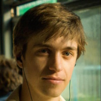
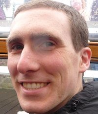

# Speakers

Speakers from throughout the Pacific Northwest will be presenting on a number of topics related to Mac administration and deployment.

A complete list of speakers will be posted after {{ site.submissions_deadline }}.

#### Stay tuned for updates by subscribing to our [Twitter](https://twitter.com/intent/follow?&screen_name=MacDevOpsYVR) feed!

Tim Sutton is a Mac sysadmin and a big fan of the MacAdmin professional community. At work, he cares and feeds for a fleet of Macs in the Faculty of Fine Arts at Concordia University in Montreal. He also maintains a several open-source tools for Mac sysadmins, tries (when possible) to solve problems using code instead of labour, and blogs about these topics at http://macops.ca.

Nick McSpadden is the Client Systems Manager at Schools of the Sacred Heart, San Francisco. He is in charge of the deployment of all client workstations and devices, including the faculty laptops and the school's 1:1 iPad program. He's used to working with different models for deployment and management of iOS devices alongside OS X devices.

